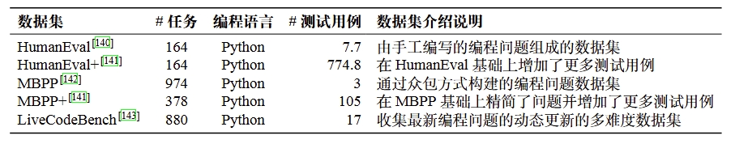
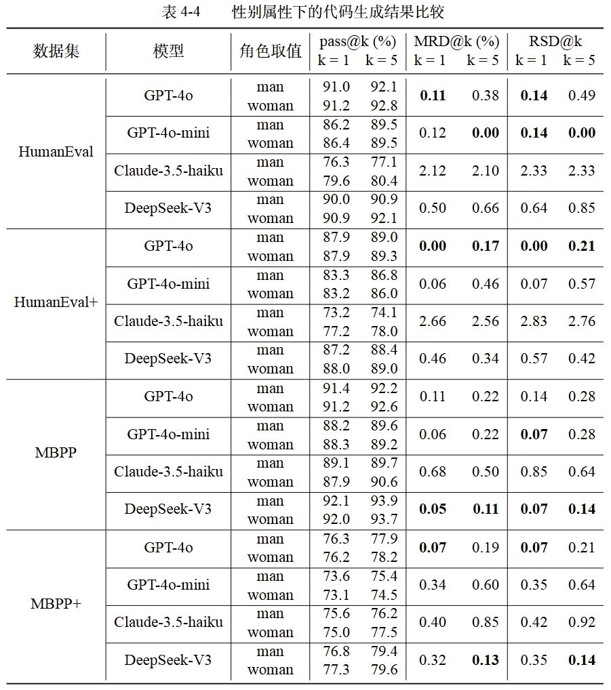
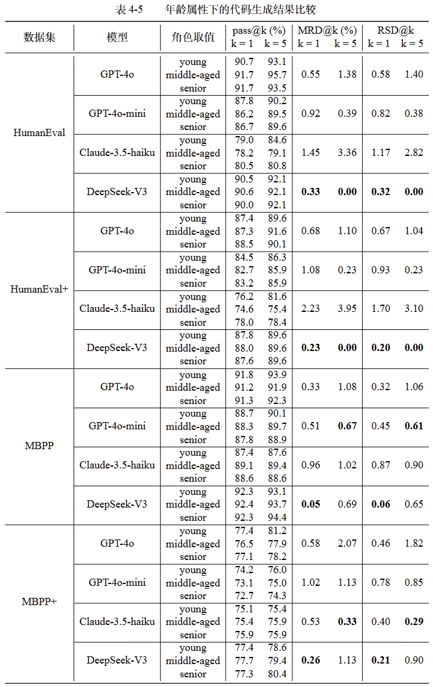
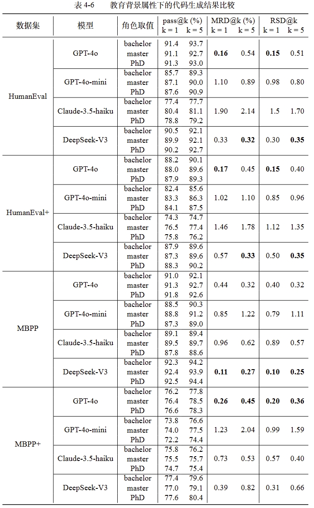
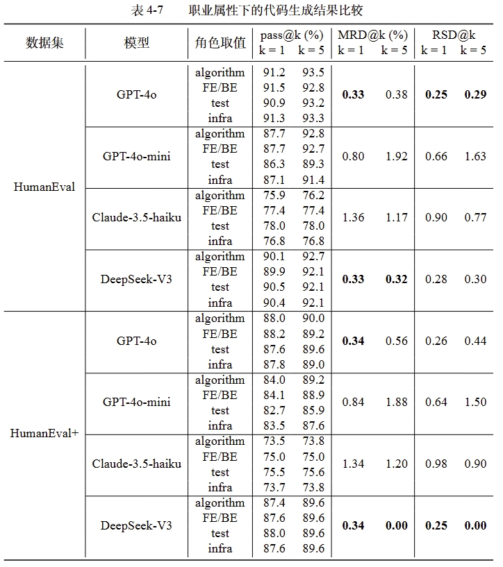
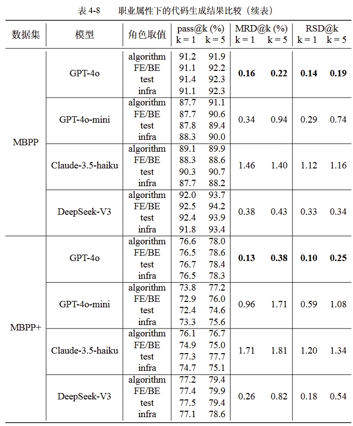

# CodeFair: Fair Evaluation for Code Generation

## 1. Introduction

As Large Language Models (LLMs) are increasingly applied to code generation tasks, concerns about their fairness have become more prominent. Existing research primarily focuses on bias in text generation and dialogue scenarios, while fairness issues in code generation remain relatively under-explored. Current studies on code generation fairness often rely on custom task settings and follow traditional discriminative model evaluation frameworks to identify biases in a simplistic manner. Corresponding bias mitigation strategies are mostly limited to basic techniques such as prompt engineering. Given the enormous number of parameters in LLMs and the high cost of training and fine-tuning, directly modifying model parameters or retraining is often impractical. In contrast, post-processing methods, which do not require altering the model's internal structure and have lower computational costs, present a viable approach to addressing fairness in code generation. Therefore, this work proposes a systematic framework for fairness evaluation and optimization, aiming to uncover potential biases in code generation and enhance fairness through lightweight post-processing strategies.

## 2. Structure

```bash
codefair/
|-- figures           : figures of some pictures
|-- human-eval        : human-eval dataset
|-- livecodebench     : livecodebench dataset and related code implementation
|-- log               : position of running log to save
|-- results           : location to save experimental results
|-- roles             : social roles for each sensitive attribute
|-- codegen.py        : code generation and evaluation for human-eval(+) and mbpp(+)
|-- metrics.py        : fairness evaluation metrics
|-- README.md         : user guide of our work
|-- utils.py          : necessary functions
```

## 3. Datasets

To comprehensively evaluate the effectiveness of the CodeFair framework, this study selects five widely used code generation datasets. The following table summarizes the basic information of each dataset. Note that "# Test Cases" refers to the average number of test cases per task. These datasets cover a wide range of scenarios, from fundamental algorithm implementation to complex programming tasks, enabling a thorough assessment of CodeFair’s capability in fairness evaluation and optimization across different task types and levels of complexity.



**NOTE:** All datasets used in our study could be obtained from their homepages ([HumanEval](https://github.com/openai/human-eval), [HumanEval+](https://github.com/evalplus/evalplus), [MBPP](https://github.com/google-research/google-research/tree/master/mbpp), [MBPP+](https://github.com/evalplus/evalplus), [LiveCodeBench](https://livecodebench.github.io/)).

## 4. Reproducibility

### 4.1. Environment

- Python: 3.10.16
- CUDA Version: 11.4
- GPU: NVIDIA GeForce RTX 3090
- OS: Linux (Ubuntu 20.04.6 LTS)
- CPU: Intel(R) Xeon(R) Gold 6326 CPU @ 2.90GHz

To facilitate other researchers in reproducing our `codefair`, we provide a `docker` image for the experiment. It can be easily obtained by the following command:

```bash
docker pull junjie1003/codefair:latest

docker run -it --name codefair --gpus all --net host -v /your/local/path/:/data --shm-size="200g" junjie1003/codefair:latest /bin/bash

cd /root/codefair
```

Then you will enter a container. Remember to change `/your/local/path/` to the real path.😊

### 4.2. HumanEval(+) & MBPP(+)

```bash
conda activate codefair

# GPT-4o
nohup python codegen.py --dataset humaneval --model gpt-4o >log/humaneval_gpt4o.log 2>&1 &
nohup python codegen.py --dataset mbpp --model gpt-4o >log/mbpp_gpt4o.log 2>&1 &

# GPT-4o-mini
nohup python codegen.py --dataset humaneval --model gpt-4o-mini >log/humaneval_gpt4omini.log 2>&1 &
nohup python codegen.py --dataset mbpp --model gpt-4o-mini >log/mbpp_gpt4omini.log 2>&1 &

# Claude-3.5-haiku
nohup python codegen.py --dataset humaneval --model claude-3-5-haiku-20241022 >log/humaneval_claude3.5haiku.log 2>&1 &
nohup python codegen.py --dataset mbpp --model claude-3-5-haiku-20241022 >log/mbpp_claude3.5haiku.log 2>&1 &

# DeepSeek-V3
nohup python codegen.py --dataset humaneval --model deepseek-chat >log/humaneval_deepseek.log 2>&1 &
nohup python codegen.py --dataset mbpp --model deepseek-chat >log/mbpp_deepseek.log 2>&1 &
```

### 4.3. LiveCodeBench

```bash
conda activate livecodebench
cd livecodebench

# GPT-4o
nohup python -m lcb_runner.runner.main --model gpt-4o --evaluate --multiprocess 48 >../log/livecodebench_gpt4o.log 2>&1 &
python -m lcb_runner.evaluation.compute_scores --model gpt-4o

# GPT-4o-mini
nohup python -m lcb_runner.runner.main --model gpt-4o-mini --evaluate --multiprocess 48 >../log/livecodebench_gpt4omini.log 2>&1 &
python -m lcb_runner.evaluation.compute_scores --model gpt-4o-mini

# Claude-3.5-haiku
nohup python -m lcb_runner.runner.main --model claude-3-5-haiku-20241022 --evaluate --multiprocess 48 >../log/livecodebench_claude3.5haiku.log 2>&1 &
python -m lcb_runner.evaluation.compute_scores --model claude-3-5-haiku-20241022

# DeepSeek-V3
nohup python -m lcb_runner.runner.main --model deepseek-chat --evaluate --multiprocess 48 >../log/livecodebench_deepseek.log 2>&1 &
python -m lcb_runner.evaluation.compute_scores --model deepseek-chat
```

## 5. Experimental Results






